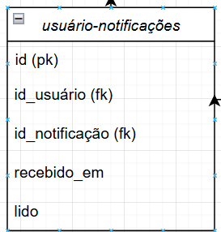
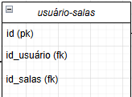
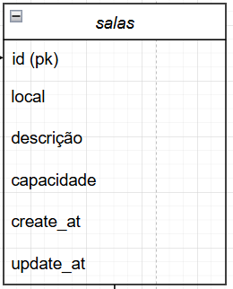
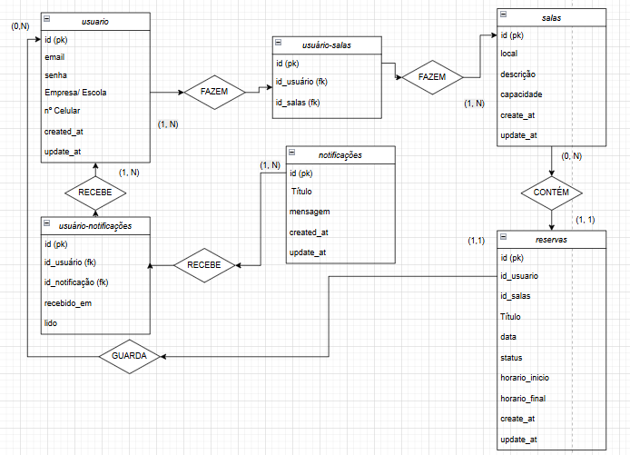
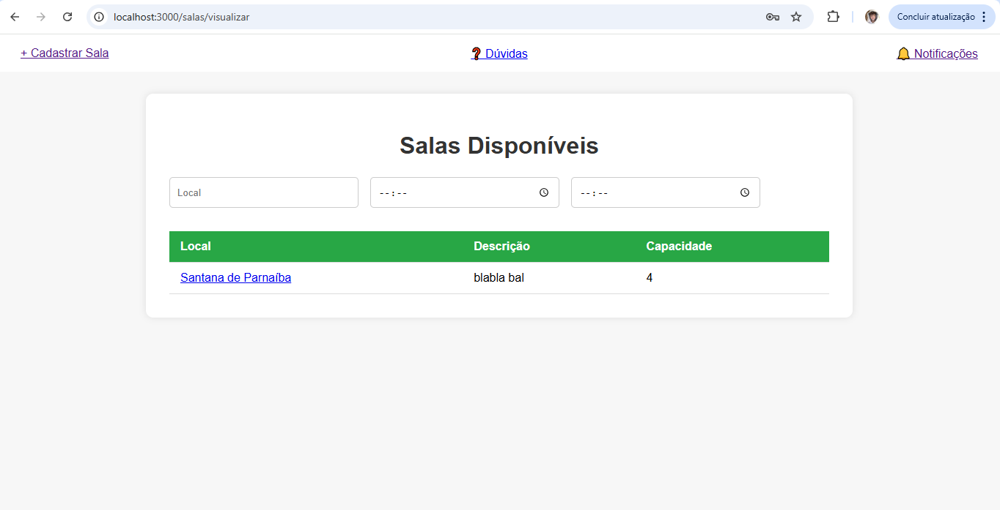

# Criação Web de Leandro Precaro - Projeto Individual - Módulo 2 - Inteli

## Nome do Projeto: 

## Autor do projeto: Leandro Precaro Barankiewicz Filho

## Sumário

1. [Introdução](#c1)  
2. [Visão Geral da Aplicação Web](#c2)  
3. [Projeto Técnico da Aplicação Web](#c3)  
4. [Desenvolvimento da Aplicação Web](#c4)  
5. [Referências](#c5)  

 

## 1. Introdução (Semana 01)

&emsp;&emsp; Como um método de aprendizado diferente dos comuns, a Inteli se destaca por ter um metodologia me que coloca seus alunos para aprenderem produzindo e nada mais justo do que aprender a programar site do zero com back-end, front-end e banco de dados. Então com a explicação acima, esse projeto será a produção de um site em JavaScript do zero, com a finalidade de ensinar todos, desde de quem nunca fez um site até mesmo quem já tem experiencia nessa área, a programar um site com tudo ja descrito, mas também utilizando o modelo MVC no seu código.

&emsp;&emsp; Neste caso, a função da Web será de sistema de reserva, no qual o usuário poderá fazer reservas de salas e terá seus cadastro, podendo ver horários disponíveis para agendamento, a disponibilidade das salas, quais estão cheias ou não, informações gerais da reserva, como data, horário, objetos dentro da sala, se foi reservada ou não. Como qualquer site, também é possível fazer novos cadastros, desmarcar revservas, dsefazer login, entre outras funcionalidades.

---

## 2. Visão Geral da Aplicação Web

### 2.1. Personas (Semana 01 - opcional)

*Posicione aqui sua(s) Persona(s) em forma de texto markdown com imagens, ou como imagem de template preenchido. Atualize esta seção ao longo do módulo se necessário.*

### 2.2. User Stories (Semana 01 - opcional)

*Posicione aqui a lista de User Stories levantadas para o projeto. Siga o template de User Stories e utilize a referência USXX para numeração (US01, US02, US03, ...). Indique todas as User Stories mapeadas, mesmo aquelas que não forem implementadas ao longo do projeto. Não se esqueça de explicar o INVEST de 1 User Storie prioritária.*

---

## 3. Projeto da Aplicação Web

### 3.1. Modelagem do banco de dados  (Semana 3)

&emsp;&emsp;&emsp; Nessa seção será demonstrado com imagens e suas devidas explicações do Diagrama Entidade e Relacionamento (DER), que a forma lógica do nosso projeto da MER (diagrama feito para identificar cada entidade e relação entre elas), e o Modelo Físico do banco de dados implementado dentro do arquivo .sql (nada mais é que a própria implementação e criação das tabelas dentro do banco de dados).

&emsp;&emsp; Será apresentado primeiramente o DER e depois o Modelo Físico.

## Diagrama Entidade e Relacionamento.

Primeiro será explicado cada entidade e depois a relação entre elas para ficar mais fácil o entendimento.

### Entiadades.

Tabela de Usuários. 

 
  Fonte: Autoral (2025) 

&emsp;&emsp; Essa tabela é referente as informações que serão guardadas quando o futuro usuário do nosso site se cadastrar em nosso site. Os atributos possíveis de ser vistos são: **ID**(número de identificação gerado automaticamente após o cadastro), **Email**, **Senha**, **Empresa/escola** e **Número de celular** são informações colocadas pelo usuários na hora do cadastro. Função de Número de celular, Email e Empresa/escola são mais para um cadastro completo e lugares de contato ou futuro envio de notificações. Já a senha é para segurança de nosso cliente. Outros dois atributos importantes são: **created_at** e o **update_at**. São responsáveis por fixar informações na hora de sua criação, como data e horário e para atualizar as informações iniciais após uma mudança nas informações do usuário, respectivamente. Além de existir a regra de negócios que  terá como função verificar, consultar e interagir com o banco de dados.

Tabela Intermediária de Usuários-Notificação. 

 
  Fonte: Autoral (2025) 

&emsp;&emsp; Por haver uma relação de N:N entre as tabelas Usuários e Notificação, é necessário, tanto para uma melhor busca nos dados quanto para bons modos do SQL, criar uma tabela intermediária que tem apenas 3 atributos: **ID** próprio, **ID_usuario** e **ID_notificacao**, esses dois responsáveis por apenas fazerem o relacionamento entre eles e essa tabela. Para a pesquisa, apenas necessário colocar o ID da notificação e do usuário para filtrar todas. Muito mais prático e fácil. Além de existir a regra de negócios que  terá como função verificar, consultar e interagir com o banco de dados.

Tabela Intermediária de Usuários-Salas. 

 
  Fonte: Autoral (2025) 

&emsp;&emsp; Por haver uma relação de N:N entre as tabelas Usuários e Salas, é necessário, tanto para uma melhor busca nos dados quanto para bons modos do SQL, criar uma tabela intermediária que tem apenas 3 atributos: **ID** próprio, **ID_usuario** e **ID_salas**, esses dois responsáveis por apenas fazerem o relacionamento entre eles e essa tabela. Para a pesquisa, apenas necessário colocar o ID da notificação e do usuário para filtrar todas. Muito mais prático e fácil. Além de existir a regra de negócios que  terá como função verificar, consultar e interagir com o banco de dados.

Tabela de Notificações. 

 
  Fonte: Autoral (2025) 

&emsp;&emsp; Essa tabela se diferencia um pouco das demais porque ela será apenas textos. Seus atributos são: **ID**(número de identificação gerado automaticamente após o envio da notificação), **Título**, como o nome já é auto-explicativo, ela será o título da notificação, **Mensagem**, ela será a descrição e o texto explicando o que será ou para que será a notificação. Outros dois atributos importantes são: **created_at** e o **update_at**. São responsáveis por fixar informações na hora de sua criação, como data e horário e para atualizar as informações iniciais após uma mudança nas informações do usuário, respectivamente. Além de existir a regra de negócios que  terá como função verificar, consultar e interagir com o banco de dados.

Tabela de Salas. 

 
  Fonte: Autoral (2025) 

&emsp;&emsp; Essa tabela é gerada após o cadastro de alguma sala para aluguel, tendo como atributos: **ID** (número de identificação gerado automaticamente após o cadastro das slas no site), **Local**, importantíssimo para que possamos filtrar as salas por locais e só entregar o que o cliente espera, **Descrição**, ela será a descrição sobre a sala apenas, **Capacidade**, também para servir de filtragem, mostrará a quantidade máxima que a sala comporta. Outros dois atributos importantes são: **created_at** e o **update_at**. São responsáveis por fixar informações na hora de sua criação, como data e horário e para atualizar as informações iniciais após uma mudança nas informações do usuário, respectivamente. Além de existir a regra de negócios que  terá como função verificar, consultar e interagir com o banco de dados.

Tabela de Reservas. 

 
  Fonte: Autoral (2025) 

&emsp;&emsp; Essa tabela é a mais complexa, já que existe mais de uma relação entre entidades e com o maior número de entidades. Seus atributos são: **ID** (número de identificação gerado automaticamente após a reserva ser solicitada), **ID_usuario**, será muito importante para que seja guardada a informação de cada solicitação e linkada ao usuário que tentou faze-la, **id_salas**, esse ID é responsável por fazer o relacionamento de dependencia da entidade sala para que a entidade reservas seja criada, **Título**, é o título da reserva, **Data, status,  horario_inicio e  horario_final** terão a mesma função de filtragem, vou explicar. Data será responsável por retirar todas as salas que não tem nesta data, Status é referente se a sala já foi alugada e horario inicio e  horario final será responsável por puxar apenas as salas que os horários entre o começo e o final do aluguel solicitado sejam mostrados. Outros dois atributos importantes são: **created_at** e o **update_at**. São responsáveis por fixar informações na hora de sua criação, como data e horário e para atualizar as informações iniciais após uma mudança nas informações do usuário, respectivamente.Além de existir a regra de negócios que  terá como função verificar, consultar e interagir com o banco de dados.
 

Diagrama ER Inteiro. 

 
  Fonte: Autoral (2025) 

&emsp;&emsp; Aqui explicarei as relações entre todas as entidades presentes no diagrama. 

### Relação entre "usuario" e "reserva" (via relacionamento N:N "FAZEM")
&emsp;&emsp;Descrição da Relação: A relação "FAZEM" entre "usuario" e "sala" é de natureza muitos-para-muitos (N:N), pois um usuário pode fazer várias reservas e uma sala pode estar associada a várias reservas feitas por diferentes usuários. Essa relação é materializada pela entidade "reserva", que serve como uma tabela intermediária para armazenar o histórico de reservas solicitadas por cada usuário.

&emsp;&emsp;Lógica: Cada registro em "reserva" está vinculado a um "id_usuario" (chave estrangeira) e a um "id_salas" (outra chave estrangeira), indicando quem solicitou a reserva e qual sala foi reservada. O histórico é mantido por meio dos atributos "título", "data", "horário_início" e "horário_final", permitindo rastrear todas as solicitações de reservas de um usuário ao longo do tempo. Isso é útil para auditoria, planejamento ou reaproveitamento de informações em futuras reservas.

### Relação entre "usuario" e "notificações" (via relacionamento 1:N "RECEBE")
&emsp;&emsp;Descrição da Relação: A relação "RECEBE" é de um-para-muitos (1:N), onde um único "usuario" (identificado por "id") pode receber múltiplas "notificações" (identificadas por "id"). Isso é indicado pela chave estrangeira "id_usuario" na entidade "notificações".

&emsp;&emsp;Lógica: As notificações são geradas para informar o usuário sobre eventos relacionados ao sistema, como confirmação de reservas, lembretes de horários, cancelamentos ou atualizações de salas. Por exemplo, quando um usuário solicita uma reserva, o sistema pode enviar uma notificação com o título e a mensagem detalhando a aprovação ou rejeição. O atributo "created_at" em "notificações" ajuda a manter um registro temporal dessas comunicações, permitindo que o usuário acompanhe todas as mensagens recebidas.

### Relação entre "sala" e "reserva" (via relacionamento 1:N "CONTÉM")
&emsp;&emsp;Descrição da Relação: A relação "CONTÉM" é de um-para-muitos (1:N), onde uma "sala" (identificada por "id") pode estar associada a várias "reservas" (identificadas por "id"), enquanto cada reserva está vinculada a apenas uma sala (via "id_salas" como chave estrangeira).

&emsp;&emsp;Lógica: Essa relação reflete o uso de uma sala específica para múltiplas reservas ao longo do tempo. Por exemplo, uma sala pode ser reservada para uma reunião hoje e para um treinamento amanhã. Os atributos "data", "horário_início" e "horário_final" em "reserva" garantem que não haja sobreposições de horários, permitindo um gerenciamento eficiente do uso das salas. Isso também facilita relatórios sobre a ocupação de cada sala.

### Relação auto-referencial em "usuario-notificações" (via relacionamento "GUARDA")
&emsp;&emsp;Descrição da Relação: A relação "GUARDA" parece ser uma auto-relação dentro do contexto de "usuario" e "notificações", sugerindo que um usuário pode estar associado a notificações de forma hierárquica ou de armazenamento. No entanto, como o diagrama mostra "usuario-notificações" como uma entidade intermediária com "id_usuario" e "id_notificações", pode indicar que as notificações são "guardadas" ou gerenciadas por um usuário específico, possivelmente um administrador.

&emsp;&emsp;Lógica: Essa relação pode ser usada para permitir que um usuário (como um gestor) gerencie ou arquive notificações enviadas a outros usuários. Por exemplo, um administrador pode receber e armazenar notificações sobre todas as reservas realizadas no sistema para fins de supervisão, com os atributos "título" e "mensagem" fornecendo detalhes sobre cada notificação arquivada, e "created_at" registrando quando foi gerada

## Modelo Físico da MER.

<h3 align="center">Código da Criação da Tabela Usuários. </h3>

Descrição:
Armazena as informações dos usuários cadastrados no sistema, como dados de login, contato e afiliação institucional.

Campos:

id: Identificador único do usuário.

email: Endereço de e-mail do usuário. É obrigatório e único, servindo como login principal.

senha: Senha de acesso ao sistema. Campo obrigatório.

empresa_escola: Nome da empresa ou escola vinculada ao usuário (opcional).

numero_celular: Número de telefone celular do usuário (opcional).

created_at: Data e hora de criação do registro, gerada automaticamente.

update_at: Data e hora da última atualização do registro.

Regras e Integridade:

O campo email possui a restrição UNIQUE para impedir duplicidade de contas.

Timestamps automáticos garantem o rastreamento de criação e atualização dos dados.

<h3 align="center">Código da Criação da Tabela Usuários-Salas. </h3>

Descrição:
Tabela de junção que representa a relação N:N entre usuários e salas, ou seja, quais usuários estão associados a quais salas.

Campos:

id: Identificador único da associação.

id_usuario: Referência ao id do usuário. A exclusão em cascata remove o relacionamento caso o usuário seja deletado.

id_salas: Referência ao id da sala. Também utiliza exclusão em cascata para manter a integridade.

UNIQUE(id_usuario, id_salas): Garante que a mesma combinação usuário-sala não seja registrada mais de uma vez, evitando duplicações.

Regras e Integridade:

Esta tabela funciona como uma ponte entre usuario e salas, viabilizando o relacionamento muitos-para-muitos.

As cláusulas ON DELETE CASCADE mantêm o banco de dados limpo ao excluir automaticamente vínculos inválidos.

<h3 align="center">Código da Criação da Tabela Usuários-Notificações. </h3>

Descrição:
Registra a relação N:N entre usuários e notificações, representando quais notificações foram enviadas para quais usuários (relação RECEBE).

Campos:

id: Identificador único.

id_usuario: Referência ao usuário que recebeu a notificação. Caso o usuário seja deletado, a notificação associada também será removida (ON DELETE CASCADE).

id_notificacao: Referência à notificação recebida. Também possui ON DELETE CASCADE para remoção automática.

recebido_em: Data e hora em que a notificação foi registrada como recebida (timestamp automático).

lido: Indica se a notificação foi lida (FALSE por padrão).

Regras e Integridade:

UNIQUE(id_usuario, id_notificacao): Garante que cada usuário receba uma notificação apenas uma vez, evitando duplicidade.

As chaves estrangeiras e exclusões em cascata ajudam a manter o banco limpo e consistente, mesmo com remoções de usuários ou notificações.

<h3 align="center">Código da Criação da Tabela Notificação. </h3>

Descrição:
Armazena as notificações geradas pelo sistema para envio aos usuários.

Campos:

id: Identificador único da notificação (UUID gerado automaticamente).

titulo: Título da notificação, obrigatório.

mensagem: Conteúdo da notificação, obrigatório.

created_at: Data e hora de criação da notificação (definido automaticamente).

update_at: Data e hora da última atualização (também automática).

Utilização:

Esta tabela centraliza as mensagens que serão posteriormente associadas aos usuários por meio da tabela de junção usuario_notificacao.

Pode ser usada para exibir alertas, lembretes ou confirmações personalizadas no sistema.

<h3 align="center">Código da Criação da Tabela Salas. </h3>

Descrição:
Armazena os dados das salas disponíveis para reserva no sistema.

Campos:

id: Identificador único da sala (UUID gerado automaticamente).

local: Localização da sala, obrigatório.

descricao: Informações adicionais sobre a sala (ex: tipo, recursos, etc.).

capacidade: Quantidade máxima de pessoas permitidas na sala (obrigatório e deve ser maior que zero).

create_at: Data e hora de criação do registro.

update_at: Data e hora da última atualização.

Utilização:

Utilizada como base para o processo de reserva.

Vinculada a usuários e reservas por meio das tabelas usuario_salas e reservas.

Garante controle de capacidade mínima com a restrição CHECK(capacidade > 0).

<h3 align="center">Código da Criação da Tabela Reservas. </h3>

Descrição:
Registra as reservas feitas por usuários para salas específicas no sistema.

Campos:

id: Identificador único da reserva (UUID gerado automaticamente).

id_usuario: Referência ao usuário que fez a reserva (chave estrangeira com exclusão em cascata).

id_salas: Referência à sala reservada (chave estrangeira com restrição de exclusão).

titulo: Breve descrição ou nome da reserva.

data: Data da reserva (obrigatória).

horario_inicio: Horário de início da reserva (obrigatório).

horario_final: Horário de término da reserva (obrigatório).

create_at: Data e hora de criação do registro.

update_at: Data e hora da última atualização.

Regras e Restrições:

CHECK (horario_final > horario_inicio): Garante que o horário final seja posterior ao horário inicial.

ON DELETE CASCADE para id_usuario: se o usuário for deletado, suas reservas também são.

ON DELETE RESTRICT para id_salas: impede deletar uma sala com reservas vinculadas.

Utilização:

Serve como o principal controle de agendamento do sistema.

Garante integridade temporal e referencial entre usuários e salas.

---

### 3.1.1 BD e Models (Semana 5)
Por questões de organização e estudos para entender melhor cada código e suas funções, decidi separar o model e deixa-lo mais simples, criando o Repository com as consultas do banco de dados e o Model apenas fazendo a descrição de cada entidade, definindo os valores de cada atributo, seus tipos e algumas validações, usando a biblioteca Joi para isso.

<h3 align="center">Código da userModel. </h3>

O model usuário é responsável por validar os dados dos usuários cadastrados no sistema. Ele garante que o nome tenha no mínimo 2 caracteres, que o email seja válido, e que a senha possua pelo menos uma letra e um número, com no mínimo 6 caracteres. O campo empresa_escola é obrigatório e deve ser uma string. Já o campo celular deve conter exatamente 11 dígitos numéricos, sendo validado tanto por tamanho quanto por padrão. O campo id é opcional e gerado automaticamente pelo banco de dados.

<h3 align="center">Código da reservasModel. </h3>

O model reserva é responsável por validar os dados relacionados às reservas feitas pelos usuários no sistema. Ele garante que id_user e id_sala sejam números inteiros e positivos, além de obrigatórios. Os campos horario_inicio e horario_final devem seguir o formato HH:mm, assegurando um horário válido. O campo status aceita apenas quatro valores específicos: pendente, confirmada, cancelada ou rejeitada. Por fim, o campo titulo é obrigatório e deve ser uma string.

<h3 align="center">Código da notificacaoModel. </h3>

O model notificação define e valida a estrutura dos dados de uma notificação no sistema, assegurando que todas as notificações criadas tenham um título e uma mensagem, ambos obrigatoriamente do tipo texto. O campo id é opcional e deve ser um número inteiro positivo, geralmente gerado automaticamente pelo banco de dados. 

<h3 align="center">Código da salaModel. </h3>

O model sala tem a função de validar os dados relacionados às salas disponíveis no sistema. Ele garante que o campo local seja uma string contendo apenas letras, enquanto o campo capacidade deve ser um número inteiro e positivo. O campo id é opcional e geralmente é gerado automaticamente pelo banco de dados. Esse model também utiliza mensagens de erro personalizadas, facilitando o entendimento dos erros pelo usuário quando os dados não seguem o formato esperado.

<h3 align="center">Código da usernotificacaoModel. </h3>

O model user_notificacao valida os dados da associação entre usuários e notificações. Ele exige que os campos id_user e id_notificacao sejam números inteiros, positivos e obrigatórios. O campo visualizado é um valor booleano que indica se a notificação foi vista, assumindo false como valor padrão.

<h3 align="center">Código da usersalaModel. </h3>

O model user_sala é responsável por validar os dados da relação entre usuários e salas no sistema, garantindo que apenas informações corretas sejam processadas. Criado com a biblioteca Joi, ele assegura que os campos id_user e id_sala sejam obrigatoriamente números inteiros e positivos, representando os IDs de um usuário e de uma sala válidos. O campo id é opcional, já que geralmente é gerado automaticamente pelo banco de dados.

### 3.2. Arquitetura (Semana 5)

O diagrama da arquitetura MVC é uma representação visual da estrutura de uma aplicação que segue o padrão Model-View-Controller. Esse diagrama ilustra como as três camadas principais (Model, View e Controller) se relacionam entre si, facilitando o entendimento do fluxo de dados e das responsabilidades de cada parte do sistema.

Diagrama da Arquitetura MVC. 

 
  Fonte: Autoral (2025) 

### 3.3. Wireframes (Semana 03 - opcional)

*Posicione aqui as imagens do wireframe construído para sua solução e, opcionalmente, o link para acesso (mantenha o link sempre público para visualização).*

### 3.4. Guia de estilos (Semana 05 - opcional)

*Descreva aqui orientações gerais para o leitor sobre como utilizar os componentes do guia de estilos de sua solução.*

### 3.5. Protótipo de alta fidelidade (Semana 05 - opcional)

*Posicione aqui algumas imagens demonstrativas de seu protótipo de alta fidelidade e o link para acesso ao protótipo completo (mantenha o link sempre público para visualização).*

### 3.6. WebAPI e endpoints (Semana 05)

Essa seção tem como função ter uma documentação que tenha todas as rotas possíveis do nosso site. 
Segue o link abaixo para ter acesso a documentação das Rotas API do site.
https://docs.google.com/document/d/1qXP6Ura9gz3WSuewzRaSLd4iKVlDks3lSRcuIeQElCI/edit?usp=sharing

### 3.7 Interface e Navegação (Semana 07)

Nesta seção será explicado o que foi desenvolvido no front end, ou seja, a parte visual do nosso site. Ainda todas as telas e funções foi implementado, mas já foi desenvolvido um grande avanço.
<h2 align= "center">Tela</h2>

Tela de Login. 

 
  Fonte: Autoral (2025) 

Como podemos ver, a tela de login é uma tela simples. Com cadastro para o nome, senha, email, empresa ou escola vinculado ao usuário e N° de celular. Ao clicar para cadastrar, o usuário será transportado para a tela onde poderá procurar salas cadastradas no banco de dados.

<h2 align= "center">Código</h2>

Códigos da Tela de Login. 

 
  Fonte: Autoral (2025) 

 
  Fonte: Autoral (2025) 

 
  Fonte: Autoral (2025) 

Como é possível ver, o CSS foi implementado dentro do ejs para uma melhor organização das pastas e para caso ocorra um erro na interface, será mais fácil identificar o erro.

O código basicamente é o CSS ( a estilização da nossa interface) a criação de caixas de textos, como nome, email, senha, com o método POST, responsável por criar o cadastrante no banco de dados.

<h2 align= "center">Tela</h2>

Tela de Filtragem de Salas. 

 
  Fonte: Autoral (2025) 

A tela de filtragem de salas é uma tela que permite ao usuário filtar as salas de acordo com o local, horário de início e horário de fim. Após filtrar, o usuário terá como ver as as salas que foram filtardas e reservar (código que faz realmente a reserva não foi feita ainda).

<h2 align= "center">Código</h2>

Códigos da Tela de Filtragem de Salas. 

 
  Fonte: Autoral (2025) 

 
  Fonte: Autoral (2025) 

 
  Fonte: Autoral (2025) 

 
  Fonte: Autoral (2025) 

 
  Fonte: Autoral (2025) 

 
  Fonte: Autoral (2025) 

 
  Fonte: Autoral (2025) 

Novamente, como no código anterior, o CSS foi implementado dentro do ejs.

Logo na parte de cima do site, foi colocado um header, com link para cadastro das salas, para dúvidas e notificações (apenas a de cadastro de salas está funcionando).

O código é feito para criar um forms, onde o usuário pode colocar o local que deseja fazer sua reserva, o horário de check in e check out e logo abaixo terá as salas filtradas.

<h2 align= "center">Tela</h2>

Tela de Cadastro de Salas. 

 
  Fonte: Autoral (2025) 

No topo superior esquerdo da tela de filtragem, é possível clicar em um link que leva para essa tela. Aqui, é possível cadastrar uma sala para que outras pessoas possam reserva-las.

<h2 align= "center">Código</h2>

Códigos da Tela de Cadastro de Salas. 

 
  Fonte: Autoral (2025) 

 
  Fonte: Autoral (2025) 

 
  Fonte: Autoral (2025) 

 
  Fonte: Autoral (2025) 

No mesmo esquema do código da tela de login, o CSS ficou no ejs para melhor organização e correção de erros.

Já a parte mais importante, é o código do forms que, como todos as outras telas, será responsável por enviar esse cadastro ao banco dados. Para uma padronização do nosso site, o header também é implementado.

## 4. Desenvolvimento da Aplicação Web (Semana 8)

### 4.1 Demonstração do Sistema Web (Semana 8)

*VIDEO: Insira o link do vídeo demonstrativo nesta seção*
*Descreva e ilustre aqui o desenvolvimento do sistema web completo, explicando brevemente o que foi entregue em termos de código e sistema. Utilize prints de tela para ilustrar.*

### 4.2 Conclusões e Trabalhos Futuros (Semana 8)

*Indique pontos fortes e pontos a melhorar de maneira geral.*
*Relacione também quaisquer outras ideias que você tenha para melhorias futuras.*

## 5. Referências

_Incluir as principais referências de seu projeto, para que o leitor possa consultar caso ele se interessar em aprofundar._ 

---
---